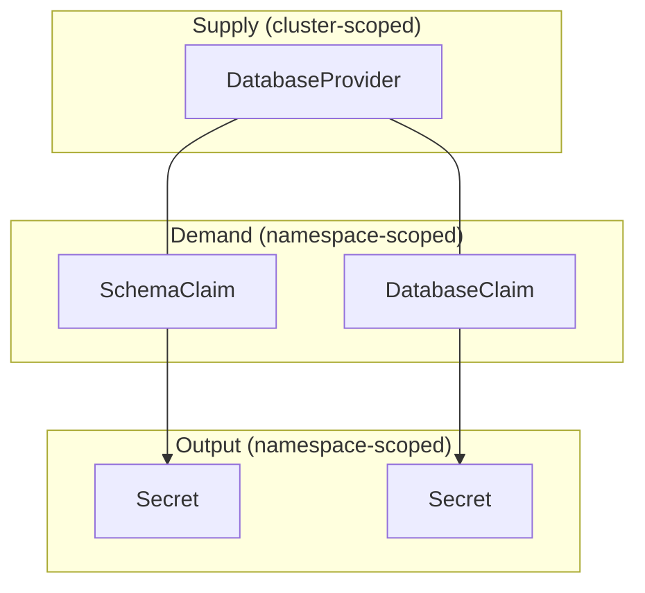
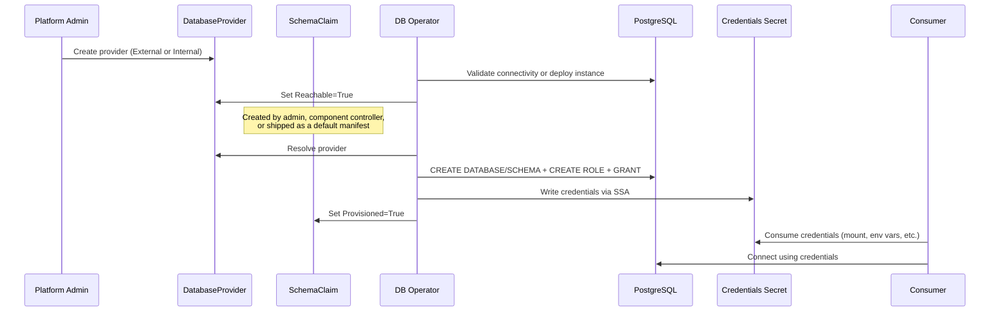

# Open Data Hub - Shared Database Infrastructure Service


|                |                                                                                                                                                                                                                                                                    |
| -------------- | ------------------------------------------------------------------------------------------------------------------------------------------------------------------------------------------------------------------------------------------------------------------ |
| Date           | August 6, 2026                                                                                                                                                                                                                                                     |
| Scope          | Operator / Platform Infrastructure                                                                                                                                                                                                                                 |
| Status         | Draft                                                                                                                                                                                                                                                              |
| Authors        | [Luca Burgazzoli](@lburgazzoli)                                                                                                                                                                                                                                    |
| Supersedes     | N/A                                                                                                                                                                                                                                                                |
| Superseded by: | N/A                                                                                                                                                                                                                                                                |
| Tickets        | [RHAIRFE-1141](https://redhat.atlassian.net/browse/RHAIRFE-1141), [RHAISTRAT-176](https://redhat.atlassian.net/browse/RHAISTRAT-176)                                                                                                                               |
| Other docs:    | [POC: opendatahub-db-operator](https://github.com/lburgazzoli/opendatahub-module-operator/tree/db-service/modules/opendatahub-db-operator), [Standardized Data Backbone proposal](https://docs.google.com/document/d/1oxlF_pwZG3sPkaogFBV_f1T9UOjW-uZsDswj5BDUMiQ) |


## What

Introduce a shared database infrastructure service that gives OpenShift AI components a declarative, Kubernetes-native way to request PostgreSQL access. The service models database provisioning after the `PersistentVolume` / `PersistentVolumeClaim` pattern:

- Platform administrators configure **supply** through `DatabaseProvider` resources
- Components express **demand** through `SchemaClaim` or `DatabaseClaim` resources

The operator binds the two and delivers connection credentials via a `Secret` in the claim's namespace.

## Why

A number of components in OpenShift AI require relational database access (Model Registry, Data Science Pipelines, TrustyAI, MLflow, and others). Today each component brings its own database engine preference, connection configuration mechanism, secret naming convention, and lifecycle management approach. This fragmentation creates three concrete problems:

1. **Installation and configuration friction.** A significant portion of support cases are traced to storage and database prerequisite setup ([RHAIRFE-1141](https://redhat.atlassian.net/browse/RHAIRFE-1141)). Platform administrators must independently configure credentials, endpoints, and connection parameters for every component that needs a database.
2. **Operational complexity at scale.** A single OpenShift AI installation can accumulate numerous small, independent database instances with no shared observability, backup strategy, or credential rotation policy. Understanding the system as a whole becomes difficult when each component manages its own database lifecycle.
3. **No out-of-the-box defaults.** There are no sensible defaults that let administrators get a working platform without manually configuring every database dependency upfront. Components that could share a single PostgreSQL instance instead each require their own from-scratch setup.

A unified database service addresses all three by giving administrators a common configuration surface for components that opt in, giving components a standard API, and providing an optional platform-managed convenience backend that works out of the box, while preserving the ability for administrators to configure independent databases for specific components and services when needed.

## Goals

- Provide a declarative Kubernetes API for components to request database access without managing database lifecycle themselves
- Model supply and demand after the `PersistentVolume` / `PersistentVolumeClaim` pattern so the concepts are familiar to Kubernetes administrators
- Support both administrator-managed PostgreSQL instances (External) and a platform-managed convenience backend (Internal)
- Deliver connection credentials as standard Kubernetes `Secret` resources in the component's namespace; consumers decide how to consume them (mount, env vars, API read, or otherwise)
- Provide a default database provider with the stable name `rhai-db` so components can reference a well-known default
- Keep shared database adoption optional: components must retain the ability to configure a specific, independent database when the platform service is not suitable or not enabled
- Allow components to select among multiple configured providers when an administrator provisions more than the default
- Provide documentation covering API-level migration: how to reconfigure existing components to consume the shared service API instead of their current per-component database configuration. This includes guidance on creating the appropriate claims, mapping existing credentials, and validating connectivity. Data migration (moving data between database instances) is a component-level responsibility independent of this service: each component or module should provide its own data migration guidance, as this is a general operational requirement regardless of whether the shared service is in use
- Enable the platform to toggle the entire feature on or off through the existing module enablement mechanism

## Non-Goals

- Building a full database-as-a-service. The Internal backend does not include enterprise-grade capabilities (HA, automated backup/restore, performance tuning, multi-engine support); customers requiring these should use an External provider
- Supporting database engines other than PostgreSQL in the initial version
- Scheduled or user-initiated credential rotation workflows
- Integration with external secret management systems (e.g., HashiCorp Vault) for credential generation and storage
- Automatic data migration from existing per-component databases to the shared instance. This ADR covers API-level migration (making components use the shared service), not data movement between database instances
- Per-component database features that are unique to a single component and have no shared equivalent
- Enterprise-grade database capabilities (multi-cluster federation, advanced replication topologies, fine-grained performance tuning). These are covered by using an External provider pointed at an appropriately configured PostgreSQL deployment

## How

The service introduces four Custom Resource Definitions across two API groups. The following sections detail the resource model, provider selection, provisioning flow, credential contract, Internal backend, default provider, adoption model, drift recovery, and security considerations.

### Resource Model

The core abstraction separates supply (where databases live) from demand (what components need):




**DatabaseProvider** (cluster-scoped, `infrastructure.opendatahub.io/v1alpha1`) describes where claims should be provisioned. Two types are supported:

- **External**: points at an existing PostgreSQL instance managed by the administrator. The operator validates connectivity using an admin `Secret` and provisions claims against it, but does not manage the instance itself. The provider configuration controls whether the operator is allowed to create databases and schemas, so administrators can restrict provisioning to only what their policies permit.
- **Internal**: the platform deploys a single-instance PostgreSQL backend within the cluster as a convenience facility. It does not provide enterprise-grade capabilities (HA, automated backup/restore); customers requiring these should use an External provider.

```yaml
# External provider: administrator-managed PostgreSQL instance
apiVersion: infrastructure.opendatahub.io/v1alpha1
kind: DatabaseProvider
metadata:
  name: production-db
spec:
  type: External
  external:
    connectionSecretRef:
      name: production-db-admin
      namespace: redhat-ai-databases
    allowedOperations:
      - SchemaCreation
```

```yaml
# Internal backend: auto-created by the DatabaseService as default
apiVersion: infrastructure.opendatahub.io/v1alpha1
kind: DatabaseProvider
metadata:
  name: rhai-db
spec:
  type: Internal
  internal:
    namespace: redhat-ai-databases
    storage:
      size: 10Gi
```

**SchemaClaim** (namespace-scoped) requests a dedicated schema and user within a database. The claim can optionally specify a target database; if omitted, it uses the default database configured on the provider.

```yaml
apiVersion: infrastructure.opendatahub.io/v1alpha1
kind: SchemaClaim
metadata:
  name: model-registry
  namespace: redhat-ai-applications
spec:
  provider:
    name: rhai-db
  database: ml_platform
  secretName: model-registry-db
  access: ReadWrite
  deletionPolicy: Retain
```

**DatabaseClaim** (namespace-scoped) requests a dedicated database and user on the provider's PostgreSQL instance. If the database does not exist and the provider allows database creation, the operator creates it. If omitted, the default database configured on the provider is used.

```yaml
apiVersion: infrastructure.opendatahub.io/v1alpha1
kind: DatabaseClaim
metadata:
  name: analytics
  namespace: redhat-ai-applications
spec:
  provider:
    name: production-db
  database: analytics_prod
  access: ReadWrite
```

**DatabaseService** (`services.platform.opendatahub.io/v1alpha1`, cluster-scoped singleton) is the module enablement CR that lets the platform toggle the entire service on or off through the standard module lifecycle mechanism. It is also where the administrator configures whether a default `DatabaseProvider` is automatically created, and under what name. By default, the service creates an Internal backend named `rhai-db` when enabled.

```yaml
apiVersion: services.platform.opendatahub.io/v1alpha1
kind: DatabaseService
metadata:
  name: default-db-operator
spec:
  defaultProvider:
    managementState: Managed
    name: rhai-db
```

### Provider Selection

Claims reference a provider by exact name or by label selector. When a selector matches multiple providers, the operator picks the one with the highest `db.infrastructure.opendatahub.io/selection-priority` annotation, breaking ties alphabetically. Once a selector-based claim binds to a provider, it keeps that provider as long as it still exists and matches. A newly appearing or higher-priority provider does not force rebinding.

### Provisioning Flow

The end-to-end flow from administrator setup to component consumption:




### Credential Contract

When a claim reaches `Provisioned=True`, the operator writes a `Secret` in the claim's namespace. The key naming follows the convention established by CloudNativePG and Crunchy PGO:


| Key        | Content                                          |
| ---------- | ------------------------------------------------ |
| `host`     | Service DNS name (Internal) or external hostname |
| `port`     | PostgreSQL port (default 5432)                   |
| `user`     | Generated role name, unique per claim            |
| `password` | Generated password                               |
| `dbname`   | Database name                                    |
| `schema`   | Schema name (`SchemaClaim` only)                 |
| `uri`      | PostgreSQL connection URI                        |


The `Secret` name defaults to the claim's name but can be overridden. The database service only writes the `Secret`; how consumers use it (volume mount, environment variables, direct API read, or any other mechanism) is entirely up to them. The service imposes no consumption machinery.

Handling credential changes (e.g., after drift recovery generates a new password) is not specific to this service; it is a general concern for any Kubernetes workload that consumes `Secret`-based configuration.

### Internal Backend

The Internal backend is a convenience facility that the platform ships to reduce initial setup friction. It does not provide enterprise-grade capabilities such as HA or automated backup/restore. Customers requiring these capabilities should use an External provider.

When an Internal `DatabaseProvider` is created, the operator deploys a single-instance PostgreSQL backend within the cluster using a Red Hat supported image. The operator manages the full lifecycle of the backing resources and restricts network access to only namespaces with active provisioned claims.

The Internal backend is intentionally limited:

- Single instance, no HA, no automated backup/restore
- Designed for getting started, development, and experimentation

When `deletionPolicy: Delete` is set, the operator can reclaim backing resources after a configurable idle grace period if no claims reference the provider. This is useful for ephemeral or experimentation scenarios where databases are short-lived.

### Default Provider

When the `DatabaseService` CR is enabled (the default), the platform automatically creates an Internal backend named `rhai-db`. Components that do not need a specific provider can reference this well-known name as their default. The default provider name is configurable through the `DatabaseService` CR but is immutable once set: changing it after initial creation is not allowed, since components and claims already reference it. If an administrator chooses a name other than the default, they are responsible for ensuring that all component configurations reference the correct provider name.

### Component Adoption Model

Adoption is opt-in and incremental. A component that adopts the shared service:

1. Ships a `SchemaClaim` (or `DatabaseClaim`) referencing a provider by name or selector
2. Consumes the credentials `Secret` through standard Kubernetes mechanisms (volume mount, environment variables, or direct API read)

Additionally, the component must retain its existing configuration path for administrators who prefer an independent database. This is a firm requirement: the shared database service is an option, not a mandate. Every component must preserve the ability to be configured with a specific, independent database connection. This keeps the system flexible for environments where a shared database is not appropriate. This dual-path is a deliberate trade-off: during the incremental adoption period, administrators may need to configure some components through the shared service and others through their legacy paths. The configuration surface converges as more components adopt the shared service, but full convergence is not a prerequisite for the service to deliver value.

When an administrator configures more than one `DatabaseProvider`, components must have a way to select which provider to use, either by referencing a specific provider name or by using a label selector that matches the desired provider's capabilities.

### Drift Recovery

Claims self-heal when their managed resources drift:

- A missing credentials `Secret` triggers re-provisioning of the PostgreSQL role and a new `Secret` write (generating a new password in this case)
- A missing schema (`SchemaClaim`) triggers schema recreation
- A missing database (`DatabaseClaim`) triggers database recreation if the provider allows it
- A missing role triggers role recreation with a new password

Repairs are performed during normal periodic reconciliation. The operator never silently drops data. `SchemaClaim` with `deletionPolicy: Retain` (the default) drops only the role on claim deletion; the schema and its data persist.

### Security and Tenant Isolation

- **Per-claim isolation**: each claim is provisioned with a unique PostgreSQL role and a dedicated password. The resulting credentials `Secret` exists only in the claim's namespace. A consumer in namespace A cannot access credentials generated for namespace B, and each role is scoped to only the resources (schema or database) requested by its claim.
- **Network isolation (Internal only)**: the operator dynamically configures a `NetworkPolicy` on the Internal backend's PostgreSQL `Pod`, allowing ingress only from namespaces with active provisioned claims. This list is recomputed on every reconcile. Namespace-level isolation is the minimum boundary provided by this service; additional security measures (e.g., pod-level or service-account-level controls) should be investigated if stricter isolation is required. For External providers, network isolation is the administrator's responsibility; this operator does not create `NetworkPolicy` resources for infrastructure it does not own.
- **No credentials in logs**: generated credentials must never be logged or cached.
- **SQL injection prevention**: all identifiers and literals interpolated into DDL must use proper quoting to prevent injection.

### Future Considerations

This ADR focuses on the initial implementation. The following items are recognized as valuable but deferred:

- **Automatic tracking migration**: an automated mechanism to discover existing per-component databases (those created ad-hoc by components before this service existed) and register them as `DatabaseProvider` + claim resources. This does not involve data migration; it ensures existing databases are tracked through the shared API so administrators have a unified view. This is a Day 2 operational improvement, not a prerequisite for initial adoption.
- **Credential rotation**: a scheduled or on-demand workflow for rotating claim credentials. The current design repairs missing credentials but does not offer proactive rotation.
- **External secret management integration**: support for delegating credential generation and storage to external systems such as HashiCorp Vault, enabling centralized secret lifecycle management and stronger security guarantees than in-operator password generation.
- **Alternative credential delegation models for External providers**: the initial design assumes the operator holds admin-level credentials to provision roles and schemas on External databases. In environments where this delegation is not acceptable, alternative models (e.g., pre-provisioned credentials supplied by DBAs, or a request-approval workflow) should be explored.
- **Non-PostgreSQL engines and CRD naming**: the initial implementation targets PostgreSQL exclusively, since all current internal service requirements are PostgreSQL-based. CRD naming (e.g., whether claims are PostgreSQL-specific like `PostgresSchemaClaim` or more generic like `SchemaClaim`) is still to be finalized and may evolve depending on whether multi-engine support becomes a goal in the future.

## Alternatives

### Single Central Secret with Operator-Led Propagation

The administrator provides a single `Secret` with PostgreSQL connection details, and the ODH Operator propagates those credentials to opted-in components. Simpler to implement, but provides no per-component isolation, no declarative demand signal, and no mechanism for multiple backends. The claim-based model subsumes this approach while retaining flexibility.

### Maintain the Per-Component Status Quo

Each component continues to manage its own database configuration independently. Requires no new infrastructure but preserves all the problems motivating this ADR: duplicated configuration, inconsistent credential management, no shared defaults, and growing support case volume.

### Standardize the Consumer Contract Only

Agree on a common `Secret` schema without building provisioning logic. Solves configuration inconsistency but not the provisioning burden; administrators still create every database, schema, role, and `Secret` manually.

### Full PostgreSQL Operator (CloudNativePG, Crunchy)

Depend on a mature PostgreSQL operator for both instance lifecycle and access management. Provides HA, backup/restore, and monitoring but introduces a heavyweight dependency. Most components only need "give me a schema and credentials" and do not need to reason about cluster topology or backup schedules. Customers who want a full PostgreSQL operator can still use one and expose it to this service through an External provider.

## Risks

- **Adoption requires cross-team coordination.**
  - *Rationale*: each component team must modify their controller to optionally consume the shared service API.
  - *Mitigation*: adoption is incremental and opt-in; components adopt at their own pace, and the existing independent database path is preserved.
- **Internal backend is single-instance with no HA.**
  - *Rationale*: a failure in the Internal backend's PostgreSQL pod affects all components using that provider.
  - *Mitigation*: the Internal backend does not provide HA or automated failover by design. Environments requiring these capabilities should use an External provider pointing at an HA-capable PostgreSQL deployment.
- **All components must support PostgreSQL.**
  - *Rationale*: the shared service targets PostgreSQL exclusively. Components that currently use a different database engine or rely on engine-specific features must add PostgreSQL support to adopt the shared service.
  - *Mitigation*: PostgreSQL is already the most common engine across OpenShift AI components. Components that cannot adopt PostgreSQL retain their independent database configuration path.
- **PostgreSQL-only scope may not cover all component needs.**
  - *Rationale*: some components may have requirements better served by a different engine.
  - *Mitigation*: components with genuinely distinct requirements keep their own database configuration; this service targets the common case, and the API naming is engine-neutral to allow future expansion.
- **Shared database creates a shared failure domain.**
  - *Rationale*: multiple components depending on the same database instance means a database outage affects multiple components simultaneously.
  - *Mitigation*: administrators who need fault isolation can configure multiple `DatabaseProvider` resources and assign components to separate backends.
- **Noisy-neighbor risk on shared instances.**
  - *Rationale*: one component's connection storms, long-running transactions, or vacuum pressure can degrade performance for all other components on the same provider.
  - *Mitigation*: resource isolation is a property of the PostgreSQL instance, not of this service. Administrators who need performance isolation should use separate providers.
- **Credential changes may cause transient consumer outages.**
  - *Rationale*: drift recovery can generate new passwords for claim credentials. Consuming components must detect the `Secret` change and re-establish connections.
  - *Mitigation*: this is a consumer-side responsibility documented in the credential contract.
- **The operator requires broad cluster privileges.**
  - *Rationale*: cross-namespace `Secret` management, cluster-scoped provider reconciliation, and database admin credentials represent a meaningful RBAC surface.
  - *Mitigation*: RBAC is scoped per-verb using Kubebuilder markers, and the operator follows the platform's existing module RBAC conventions. Security review should evaluate the privilege surface as part of the module onboarding process.
- **Users may rely on the Internal backend without understanding it lacks enterprise-grade features.**
  - *Rationale*: the default provider is auto-created with a stable name and works out of the box, which makes it easy for users to normalize around it without switching to an External provider.
  - *Mitigation*: documentation and status reporting should clearly communicate that the Internal backend does not include HA, automated backup/restore, or other enterprise-grade capabilities. The platform may surface warnings when these features would be expected.
- **Success depends on cross-organizational alignment.**
  - *Rationale*: adoption requires coordination across platform engineering, individual component teams, and customer database administrators, each with different priorities and constraints.
  - *Mitigation*: the opt-in model and preserved independent configuration path reduce the urgency of full alignment. Components can adopt incrementally without requiring all stakeholders to agree upfront.

## Stakeholder Impacts


| Group                    | Key Contacts               | Date | Impacted? |
| ------------------------ | -------------------------- | ---- | --------- |
| Architects Team          | @opendatahub-io/architects |      | y         |
| Platform Team (Operator) |                            |      | y         |
| Model Registry           |                            |      | y         |
| Data Science Pipelines   |                            |      | y         |
| TrustyAI                 |                            |      | y         |
| MLflow                   |                            |      | y         |


## References

- [POC: opendatahub-db-operator](https://github.com/lburgazzoli/opendatahub-module-operator/tree/db-service/modules/opendatahub-db-operator): proof of concept implementation with full CRD definitions, controller logic, and integration tests
- [RHAIRFE-1141: Unified storage configuration for RHOAI components](https://redhat.atlassian.net/browse/RHAIRFE-1141)
- [RHAISTRAT-176: Connections 2.0](https://redhat.atlassian.net/browse/RHAISTRAT-176)
- [Standardized Data Backbone proposal](https://docs.google.com/document/d/1oxlF_pwZG3sPkaogFBV_f1T9UOjW-uZsDswj5BDUMiQ)
- [Kubernetes PersistentVolumeClaim documentation](https://kubernetes.io/docs/concepts/storage/persistent-volumes/)

## Reviews


| Reviewed by | Date | Notes |
| ----------- | ---- | ----- |
|             |      |       |


